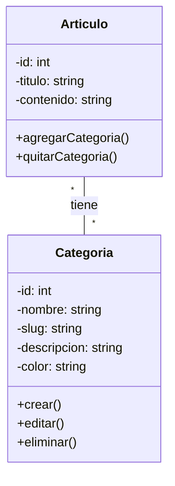

### 🏫 **Institución:** IES 9-018 "Gobernador Celso Jaque"
### 📚 **Carrera:** Tecnicatura Superior en Desarrollo de Software
### 📖 **Materia:** Modelado de Software
### 👨‍🏫 **Profesor:** Paulo Alvarez
---
# Clase 4: Creando Tu Propia Versión - De Fork a Producto Independiente

## 1. Objetivos de la Clase

Al finalizar esta clase, serás capaz de:

*   Crear **tu propia versión independiente** del proyecto (como Cursor es de VSCode).
*   Comprender y aplicar **Versionado Semántico (SemVer)** a TU producto.
*   Crear y gestionar **tags** en Git para marcar releases de TU versión.
*   Mantener un **CHANGELOG.md** profesional documentando la evolución de TU proyecto.
*   Divergir del proyecto original agregando funcionalidades únicas.
*   Establecer la identidad de TU proyecto con branding y documentación propia.

---

## 2. El Gran Paso: De Colaborador a Creador

### 2.1. Proyectos Fork Famosos en la Industria

En el mundo real, muchos proyectos exitosos nacieron como forks que evolucionaron independientemente:

| Proyecto Original | Fork Independiente | ¿Qué lo hace único? |
|------------------|-------------------|---------------------|
| **Visual Studio Code** | **Cursor** | Editor con IA integrada y copilot nativo |
| **Visual Studio Code** | **VSCodium** | VSCode sin telemetría de Microsoft |
| **Chromium** | **Brave Browser** | Privacidad + sistema de recompensas |
| **Chromium** | **Opera** | VPN integrada + bloqueador de ads |
| **MySQL** | **MariaDB** | Optimizaciones de rendimiento + nuevas features |
| **OpenOffice** | **LibreOffice** | Desarrollo más activo + mejor compatibilidad |
| **Android AOSP** | **LineageOS** | Android sin servicios de Google |

**¿Qué tienen en común estos forks exitosos?**
- ✅ Empezaron con el código base del proyecto original
- ✅ Agregaron funcionalidades únicas que los diferencian
- ✅ Tienen su propio **versionado independiente** (v1.0, v2.0, etc.)
- ✅ Mantienen su propia documentación y changelog
- ✅ Tienen su propia **identidad de marca** (nombre, logo, comunidad)
- ✅ Son proyectos completamente separados con su propia hoja de ruta

### 2.2. Tu Misión: Crea Tu Propio CMS/Blog

Hoy vas a crear **"TU-NOMBRE-Blog"** o **"TU-NOMBRE-CMS"** como una versión independiente del proyecto "Institución Digital". 

**Ejemplos de nombres para tu versión:**
- MariaBlog v1.0.0
- CarlosCMS v1.0.0  
- BlogMax v1.0.0
- QuickPost v1.0.0

**No es solo un fork para contribuir al original**, es **tu propio producto** que:
- Tiene tu propio nombre y branding
- Incluye funcionalidades únicas que TÚ decides
- Sigue tu propio sistema de versiones independiente
- Tiene su propio changelog documentando TU evolución
- Puede tomar diferentes decisiones de diseño

---

## 3. Conceptos Clave de Hoy

### 3.1. Versionado Semántico (Semantic Versioning)

Cuando creas tu propia versión de un proyecto, necesitas un sistema claro para comunicar cambios.

*   **Término Clave: `Semantic Versioning (SemVer)` - Versionado Semántico**
    *   **¿Qué es?** Un sistema estándar de numeración: `MAJOR.MINOR.PATCH`
    *   **¿Por qué se usa?** Para comunicar el impacto de cambios a usuarios y otros desarrolladores
    *   **Formato:** `vMAJOR.MINOR.PATCH` (ej: `v1.2.10`, `v2.5.35`)

#### Desglose del Número de Versión

```
     v2.5.35
     │ │ │
     │ │ └─── PATCH (Parche): Correcciones de bugs
     │ │      • NO agrega funcionalidades nuevas
     │ │      • Solo arregla problemas existentes
     │ │      • Ejemplo: v1.2.3 → v1.2.4 (arreglé error en login)
     │ │
     │ └───── MINOR (Menor): Nueva funcionalidad COMPATIBLE
     │        • Agrega features nuevas
     │        • NO rompe compatibilidad con versión anterior
     │        • Ejemplo: v1.2.4 → v1.3.0 (agregué categorías)
     │
     └─────── MAJOR (Mayor): Cambios INCOMPATIBLES
              • Cambios que rompen compatibilidad
              • Requiere ajustes en quien use tu proyecto
              • Ejemplo: v1.9.5 → v2.0.0 (cambié estructura de BD)
```

#### Ejemplos Reales de Versionado

**Ejemplo 1: Cursor (fork de VSCode)**
```
v0.1.0  - Primera versión pública con IA básica
v0.2.0  - Agregaron Cursor Tab (autocompletado IA)
v0.2.1  - Arreglaron bug en Cursor Tab
v0.3.0  - Agregaron Cursor Chat
v0.3.1  - Mejoraron rendimiento de Chat
v1.0.0  - Lanzamiento oficial con arquitectura rediseñada
```

**Ejemplo 2: Tu BlogMax**
```
v1.0.0  - Primera versión: CRUD de artículos + comentarios
v1.1.0  - Agregaste sistema de categorías
v1.1.1  - Arreglaste bug en filtro de categorías
v1.2.0  - Agregaste sistema de etiquetas (tags)
v2.0.0  - Cambiaste de SQL a NoSQL (breaking change)
```

### 3.2. Tags en Git

*   **Término Clave: `Git Tag` - Etiqueta**
    *   **¿Qué es?** Una marca permanente en el historial de Git apuntando a un commit específico
    *   **¿Por qué se usa?** Para marcar releases/versiones importantes de TU proyecto
    *   **Tipos:**
        *   `Lightweight tag`: Solo un puntero a un commit
        *   `Annotated tag`: Incluye mensaje, autor, fecha (¡usa este!)

**Comandos:**
```powershell
# Crear un tag anotado para tu versión 1.0.0
git tag -a v1.0.0 -m "Release 1.0.0: Primera versión de MariaBlog"

# Ver todos tus tags
git tag --list

# Ver detalles de un tag
git show v1.0.0

# Subir tags a GitHub (para que aparezcan en Releases)
git push origin v1.0.0
# O subir todos los tags:
git push origin --tags
```

### 3.3. CHANGELOG.md - La Historia de Tu Proyecto

*   **Término Clave: `CHANGELOG` - Registro de Cambios**
    *   **¿Qué es?** Un archivo que documenta todos los cambios notables en tu proyecto
    *   **¿Por qué se usa?** Para que usuarios y desarrolladores entiendan qué cambió entre versiones
    *   **Formato estándar:** [Keep a Changelog](https://keepachangelog.com/)

**Estructura de un buen CHANGELOG:**

```markdown
# Changelog - MariaBlog

Todos los cambios notables en MariaBlog se documentan en este archivo.

El formato está basado en [Keep a Changelog](https://keepachangelog.com/),
y este proyecto adhiere a [Semantic Versioning](https://semver.org/).

## [1.1.0] - 2025-11-15

### Agregado (Added)
- Sistema de categorías para artículos
- Filtro de artículos por categoría en página principal
- Nueva página de administración de categorías

### Cambiado (Changed)
- Mejorado el diseño del dashboard de autor
- Actualizada documentación con nuevos diagramas UML

### Corregido (Fixed)
- Arreglado bug que impedía editar comentarios
- Corregido error de validación en formulario de artículos

## [1.0.0] - 2025-11-01

### Agregado
- Funcionalidad básica de CRUD de artículos
- Sistema de comentarios para visitantes
- Autenticación de autores
- Dashboard para gestión de contenido

---
```

### 3.4. .gitignore - Mantén Tu Repo Limpio

*   **Término Clave: `.gitignore` - Archivo de Exclusión**
    *   **¿Qué es?** Un archivo que le dice a Git qué archivos NO versionar
    *   **¿Por qué se usa?** Para evitar subir archivos temporales, dependencias, configuraciones locales

**Ejemplo de .gitignore para tu proyecto:**

```gitignore
# Archivos del sistema operativo
.DS_Store
Thumbs.db
desktop.ini

# IDEs y editores
.vscode/
.idea/
*.swp
*.swo
*~

# Dependencias (si usas Node.js, Python, etc.)
node_modules/
venv/
__pycache__/
*.pyc

# Archivos de configuración local
.env
.env.local
config.local.json

# Archivos de build
dist/
build/
*.log

# Bases de datos locales
*.sqlite
*.db
```

---

## 4. Manos a la Obra: Crea Tu Propia Versión

### Tutorial Paso a Paso

#### **Paso 1: Renombra y Personaliza Tu Fork**

1. Ve a tu fork en GitHub: `https://github.com/TU-USUARIO/proyecto-modelado-2025`
2. Settings → Repository name → Cámbialo a tu nombre único (ej: `mariablog`, `carlos-cms`)
3. Settings → Description → Escribe: "Mi propia versión de CMS/Blog basada en Institución Digital"
4. En tu copia local:
   ```powershell
   # Actualizar el remote con el nuevo nombre
   git remote set-url origin https://github.com/TU-USUARIO/TU-NUEVO-NOMBRE.git
   ```

#### **Paso 2: Establece la Identidad de Tu Proyecto**

Crea o actualiza el `README.md` de tu proyecto:

```markdown
# MariaBlog v1.0.0

> Mi propia versión de CMS/Blog, fork de "Institución Digital" con funcionalidades únicas.

## 🌟 Qué hace único a MariaBlog

- Sistema de categorías mejorado
- Interfaz simplificada para escritura rápida
- [Agrega aquí tus features únicas]

## 🚀 Basado en

Este proyecto es un fork independiente de [IES9018/proyecto-modelado-2025](https://github.com/IES9018/proyecto-modelado-2025).

## 📋 Roadmap

- [x] v1.0.0 - Sistema base de blog
- [ ] v1.1.0 - Sistema de categorías
- [ ] v1.2.0 - Sistema de etiquetas
- [ ] v2.0.0 - Editor Markdown integrado

## 📜 Licencia

[Especifica tu licencia]
```

#### **Paso 3: Crea Tu Primera Versión (v1.0.0)**

1. **Documenta el estado actual en CHANGELOG.md:**

```markdown
# Changelog - MariaBlog

## [1.0.0] - 2025-11-07

### Agregado
- Fork inicial de proyecto-modelado-2025
- Establecida identidad de MariaBlog
- Documentación inicial en README
- Sistema base: CRUD artículos + comentarios

[1.0.0]: https://github.com/TU-USUARIO/mariablog/releases/tag/v1.0.0
```

2. **Crea el tag v1.0.0:**

```powershell
# Asegúrate de estar en main
git checkout main

# Haz commit de tus cambios (README, CHANGELOG)
git add README.md CHANGELOG.md
git commit -m "docs: establecer identidad de MariaBlog v1.0.0"

# Crea el tag anotado
git tag -a v1.0.0 -m "Release 1.0.0: Primera versión oficial de MariaBlog

- Fork inicial del proyecto Institución Digital
- Establecida identidad y branding
- Sistema base funcional
"

# Sube cambios y tag a GitHub
git push origin main
git push origin v1.0.0
```

3. **Crea el Release en GitHub:**
   - Ve a tu repo → Releases → "Create a new release"
   - Choose tag: `v1.0.0`
   - Title: "MariaBlog v1.0.0 - Primera Release Oficial"
   - Descripción: Copia el contenido de tu CHANGELOG para esta versión
   - Publish release

#### **Paso 4: Agrega Tu Feature Única (v1.1.0)**

Ahora vas a agregar algo que haga TU versión diferente. Ejemplo: **Sistema de Categorías Mejorado**.

1. **Crea una rama para tu feature:**

```powershell
git checkout -b feature/categorias-v1.1.0
```

2. **Modela tu nueva funcionalidad:**

Crea `diagramas/clase-categoria.md`:

```markdown
## Diagrama de Clases - Sistema de Categorías



## Caso de Uso: Gestionar Categorías

**Actor principal:** Autor

**Flujo principal:**
1. El Autor accede a "Gestión de Categorías"
2. El sistema muestra lista de categorías existentes
3. El Autor crea una nueva categoría "Tecnología"
4. El sistema guarda la categoría
5. Al crear/editar artículos, puede asignar categorías

```

3. **Actualiza CHANGELOG.md:**

```markdown
# Changelog - MariaBlog

## [1.1.0] - 2025-11-10 (Por liberar)

### Agregado
- Sistema completo de categorías para artículos
- Cada categoría tiene: nombre, slug, descripción y color
- Filtro de artículos por categoría en vista pública
- Panel de administración de categorías para autores
- Diagrama de clases para sistema de categorías

### Cambiado
- Mejorada interfaz de creación de artículos
- Actualizado README con nueva funcionalidad

## [1.0.0] - 2025-11-07

### Agregado
- Fork inicial de proyecto-modelado-2025
- Establecida identidad de MariaBlog
- Documentación inicial en README
- Sistema base: CRUD artículos + comentarios
```

4. **Mergea en tu main (¡en TU fork!):**

```powershell
# Commitea todos los cambios
git add .
git commit -m "feat: agregar sistema de categorías v1.1.0

- Agregado modelo de Categoria con relación many-to-many con Articulo
- Creados diagramas UML para nueva funcionalidad
- Actualizado CHANGELOG
"

# Vuelve a main
git checkout main

# Mergea tu feature
git merge feature/categorias-v1.1.0

# Crea el nuevo tag
git tag -a v1.1.0 -m "Release 1.1.0: Sistema de Categorías

- Gestión completa de categorías
- Filtros por categoría
- Mejoras en UX de creación de artículos
"

# Sube todo
git push origin main
git push origin v1.1.0
```

5. **Crea el Release v1.1.0 en GitHub**

#### **Paso 5: (Opcional) Abre PR al Repo Original**

Si quieres **contribuir tu mejora de categorías** al proyecto original:

1. Ve a GitHub: Tu fork → Pull requests → New pull request
2. Base: `IES9018/proyecto-modelado-2025` `main`
3. Compare: `TU-USUARIO/mariablog` `main`
4. Título: `feat: sistema de categorías (contribución desde MariaBlog)`
5. Descripción:
   ```markdown
   ## Descripción
   
   Sistema de categorías desarrollado en mi fork independiente MariaBlog v1.1.0.
   Propongo integrar esta funcionalidad al proyecto original.
   
   ## Cambios incluidos
   - Modelo de Categoria con relación many-to-many
   - Diagramas UML actualizados
   - Panel de administración
   
   ## Documentación
   Ver CHANGELOG de MariaBlog v1.1.0 para detalles completos.
   ```

**¡Importante!** El PR es opcional. Tu versión vive independientemente, puedes contribuir o no al original.

---

## 5. Configuración Profesional Adicional

### 5.1. Archivo .gitignore

Crea `.gitignore` en la raíz de tu proyecto:

```gitignore
# Sistema operativo
.DS_Store
Thumbs.db

# Editores
.vscode/
.idea/
*.swp

# Dependencias
node_modules/
venv/

# Configuración local
.env
config.local.*

# Build
dist/
build/

# Logs
*.log

# Base de datos local
*.sqlite
*.db
```

### 5.2. Licencia

Decide la licencia de TU proyecto. Opciones comunes:

- **MIT**: Muy permisiva, permite uso comercial
- **GPL**: Obliga a compartir el código
- **Apache 2.0**: Permisiva con protección de patentes

Crea `LICENSE` en tu repo con el texto de la licencia elegida.

### 5.3. Contributing Guidelines

Aunque es tu proyecto personal, si planeas aceptar contribuciones:

Crea `CONTRIBUTING.md`:

```markdown
# Contribuyendo a MariaBlog

¡Gracias por tu interés!

## Proceso

1. Fork este repo
2. Crea una rama (`git checkout -b feature/mi-feature`)
3. Commit tus cambios (`git commit -m 'feat: agregar X'`)
4. Push a la rama (`git push origin feature/mi-feature`)
5. Abre un Pull Request

## Versionado

Usamos [SemVer](https://semver.org/) para versionar.

## Licencia

Al contribuir, aceptas que tu código se licencie bajo [TU LICENCIA].
```

---

## 6. Comandos de Git para Hoy

### Gestión de Tu Versión Independiente

```powershell
# Ver todas tus versiones (tags)
git tag --list

# Ver detalles de una versión
git show v1.1.0

# Crear una nueva versión
git tag -a v1.2.0 -m "Descripción de cambios"

# Subir una versión específica
git push origin v1.2.0

# Subir todas las versiones
git push origin --tags

# Eliminar un tag local (si te equivocaste)
git tag -d v1.0.0

# Eliminar un tag remoto
git push origin --delete v1.0.0

# Ver historial con tags
git log --oneline --graph --all --decorate
```

---

## 7. Checklist de Esta Clase

- [ ] Renombré mi fork con un nombre único
- [ ] Creé README.md estableciendo la identidad de mi proyecto
- [ ] Creé CHANGELOG.md siguiendo formato estándar
- [ ] Creé tag v1.0.0 para marcar mi primera versión
- [ ] Publiqué release v1.0.0 en GitHub
- [ ] Agregué una funcionalidad única (ej: categorías)
- [ ] Actualicé CHANGELOG con v1.1.0
- [ ] Creé tag v1.1.0
- [ ] Publiqué release v1.1.0 en GitHub
- [ ] Configuré .gitignore adecuadamente
- [ ] (Opcional) Abrí PR al repo original contribuyendo mi feature

---

## 8. Recursos Adicionales

*   **Versionado Semántico:** [semver.org](https://semver.org/lang/es/)
*   **Keep a Changelog:** [keepachangelog.com](https://keepachangelog.com/)
*   **Git Tags:** [Documentación oficial](https://git-scm.com/book/en/v2/Git-Basics-Tagging)
*   **Ejemplos de forks exitosos:**
    *   [Cursor (fork de VSCode)](https://www.cursor.com/)
    *   [MariaDB (fork de MySQL)](https://mariadb.org/)
    *   [LibreOffice (fork de OpenOffice)](https://www.libreoffice.org/)

---

## 9. Resumen y Próximos Pasos

Hoy diste un gran paso: transformaste un fork colaborativo en **tu propio proyecto independiente**. Aprendiste:

✅ Cómo proyectos famosos nacieron como forks  
✅ Versionado semántico para comunicar cambios  
✅ Tags de Git para marcar hitos  
✅ CHANGELOG profesional  
✅ Configuración de proyecto independiente  

**Tu proyecto ahora es:**
- Un producto con identidad propia
- Versionado profesionalmente
- Documentado claramente
- Listo para evolucionar independientemente

**Próximos pasos sugeridos:**
- Continúa agregando features únicas a TU versión
- Mantén actualizado tu CHANGELOG
- Crea releases regularmente (v1.2.0, v1.3.0, etc.)
- Opcionalmente contribuye mejoras al proyecto original
- Considera crear una página web para TU proyecto
- Construye una comunidad alrededor de TU versión

**En la siguiente clase**, exploraremos patrones de diseño avanzados y arquitecturas escalables para llevar tu proyecto al siguiente nivel.

**¡Tu versión, tus reglas, tu evolución!** 🚀
